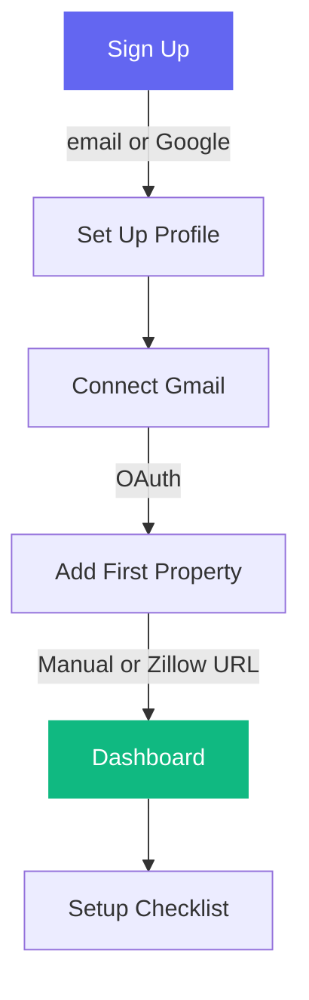
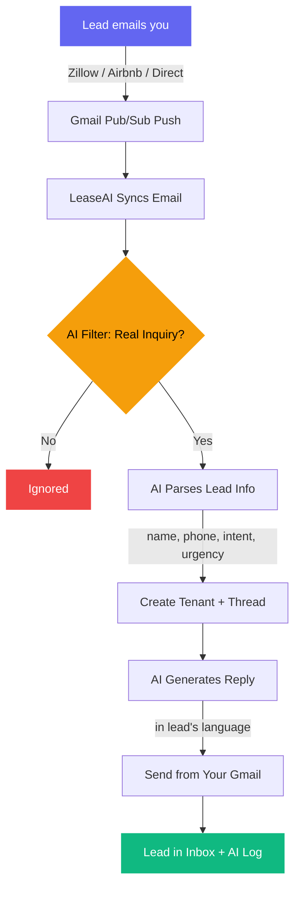
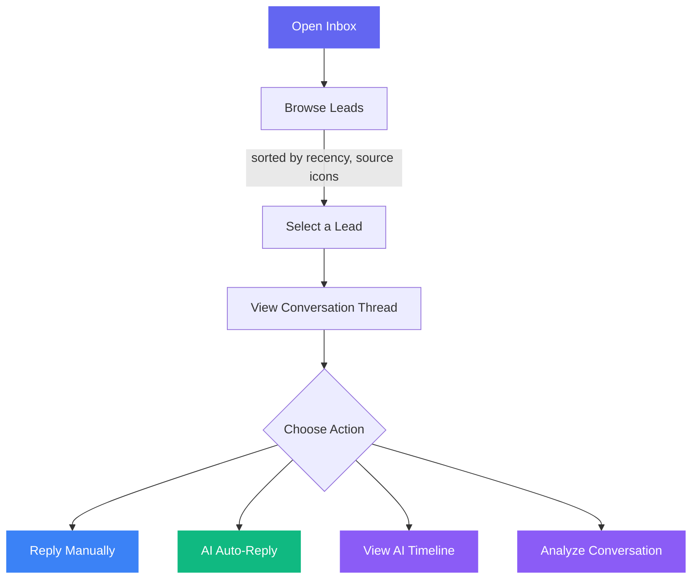
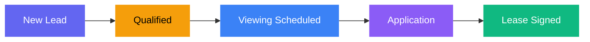
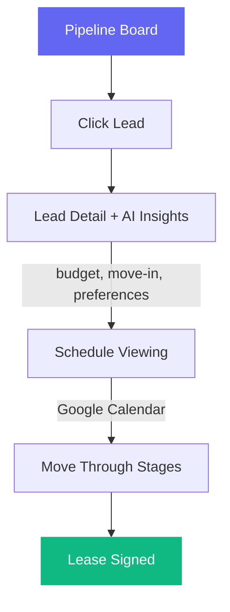
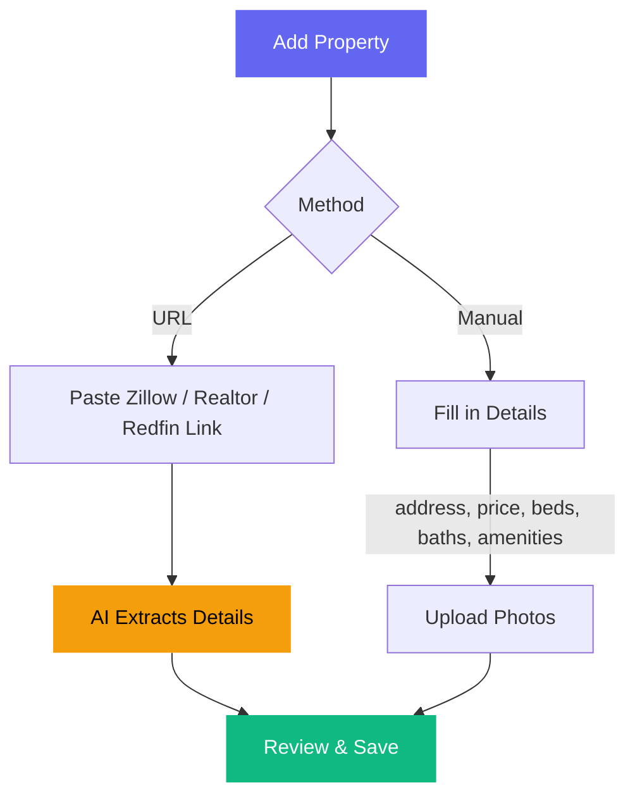
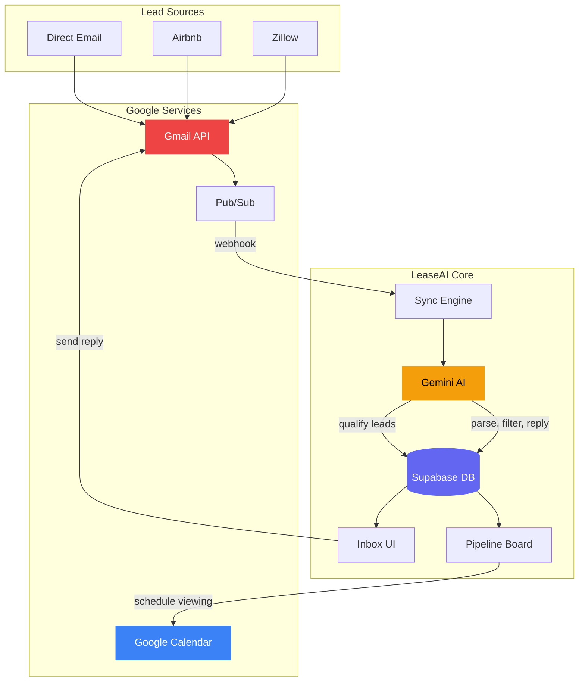

# LeaseAI — MVP

## What is LeaseAI?

LeaseAI is an AI-powered assistant for landlords that automatically captures leads from Gmail, qualifies them, and replies — so you never miss a rental inquiry again.

---

## Core Features

### 1. Smart Inbox

Connect your Gmail and LeaseAI automatically:

- Syncs your inbox in real-time (Gmail Pub/Sub push notifications)
- Detects rental inquiries from Zillow, Airbnb, Apartments.com, and direct emails
- Filters out spam, newsletters, and non-lead emails using AI
- Extracts lead info: name, email, phone, intent, urgency, budget
- Groups all messages into per-lead conversation threads

### 2. AI Auto-Reply

When a new lead comes in, LeaseAI:

- Analyzes the inquiry (what property, what they want, how urgent)
- Drafts a professional, language-aware reply matching the lead's language
- Sends it from your Gmail — the lead sees your real email, not a bot

### 3. Lead Pipeline

Track every lead from first contact to signed lease:

- **Kanban board** with drag-and-drop stages: New Lead → Qualified → Viewing Scheduled → Application → Lease Signed
- **Lead table** view with filters and search
- **Lead detail page** with full conversation history, AI-generated insights (budget, move-in date, preferences)

### 4. AI Lead Qualification

LeaseAI qualifies leads by gathering 8 key data points through natural conversation:

- Move-in date, budget, employment, number of occupants
- Pet situation, lease term preference, viewing availability
- Responds in the lead's language with proper AI disclosure

### 5. Property Management

- Add properties manually or import from Zillow, Realtor.com, or Redfin by URL
- AI extracts property details from listing pages automatically
- Full property specs: price, beds, baths, sqft, amenities, parking, pet policy
- Property image upload and gallery

### 6. Calendar & Showings

- Connect Google Calendar
- Check your availability (free/busy) before scheduling
- Book viewings directly — creates calendar events
- View today's appointments from the dashboard

### 7. Contracts

- Create lease contracts linked to specific properties and tenants
- Rich text editor for contract content
- Track contract status

---

## User Flows

### Flow 1: First-Time Setup

### Flow 2: New Lead Arrives (Automated)

### Flow 3: Working the Inbox

### Flow 4: Lead Pipeline

### Flow 5: Adding a Property

### System Architecture Overview

---

## Tech Under the Hood

| Component | Technology |
|-----------|------------|
| App | Next.js 14, TypeScript, React 18 |
| UI | Tailwind CSS, Framer Motion |
| Auth | Supabase Auth (email + Google/GitHub OAuth) |
| Database | Supabase (PostgreSQL) with Row Level Security |
| Storage | Supabase Storage (property images, avatars) |
| AI | Google Gemini 2.5 Flash |
| Email | Gmail API + Google Pub/Sub (real-time) |
| Calendar | Google Calendar API |
| Payments | Stripe (subscription billing) |
